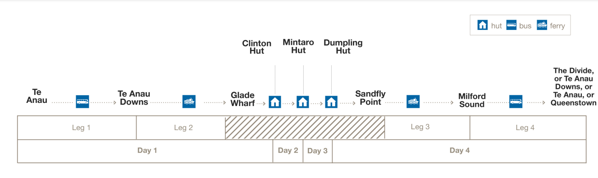
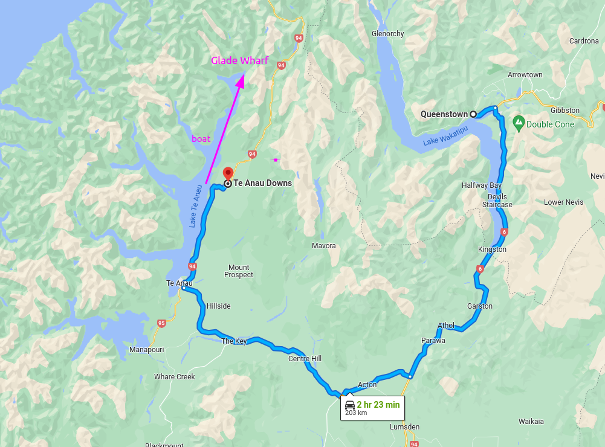
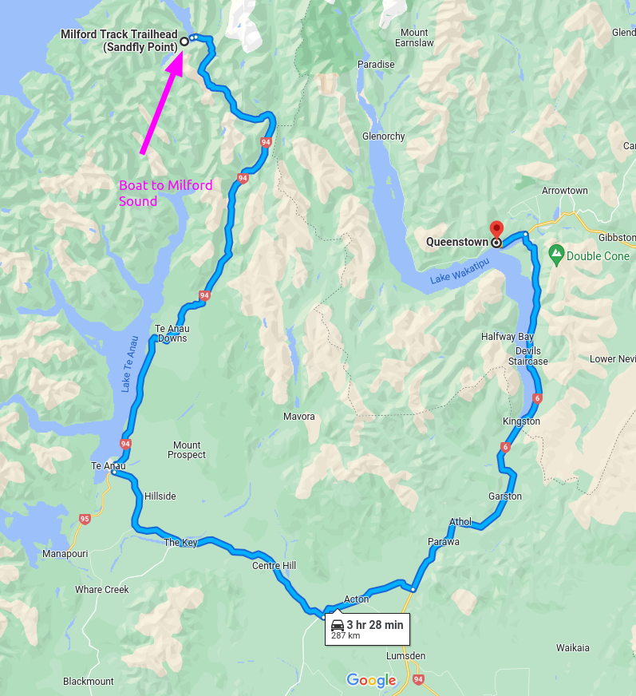

# Hike Overview (Nov 20th Crew)

[DOC info](https://www.doc.govt.nz/parks-and-recreation/places-to-go/fiordland/places/fiordland-national-park/things-to-do/tracks/milford-track/)

## Day 1 - Glade Wharf to Clinton Hut

* **Date**: Sunday 20th November
* **Time**: 1–1 hr 30 min
* **Distance**: 5 km

## Day 2 - Clinton Hut to Mintaro Hut

* **Date**: Monday 21st November
* **Time**: 6 hr
* **Distance**: 17.5 km

## Day 3 - Mintaro Hut to Dumpling Hut

This is the day we go over Mackinnon Pass, which will be the most physically demanding and cold (alpine environment)

* **Date**: Tuesday 22nd November
* **Time**: 6–7 hr
* **Distance**: 13 km

## Day 4 - Dumpling Hut to Sandfly Point

* **Date**: Wednesday 23rd November
* **Time**: 5 hr 30 min – 6 hr
* **Distance**: 18 km

# Transport

(Not sure if "Leg 1" needs to be separate, there is probably transport direct to Te Anau Downs from Queenstown?)

## Transport to organise:

* Flights to Queenstown prior to (or early on) Sunday 20th November
* Transport from Queenstown to Glade Wharf on 20th November
  * Bus or private transport to Te Anau Downs (30min)
  * Boat trip to Glade Wharf (1h 15min)
* Transport from Sandfly Point back to Queenstown
  * Boat trop to Milford Sound/Piopiotahi (20min)
  * Bus services back to Te Anau (and on to Queenstown)
* Flights from Queenstown after (or late on) Wednesday 23rd November

Transport must be booked in advance. Some recommended companies that provide transport for milford track:

* [Cheeky Kiwi](https://www.cheekykiwitravel.com/)
* [EasyHike](https://www.easyhike.co.nz/milford-track-transport/)
* [Fiordland Outdoors Company](https://www.fiordlandoutdoors.co.nz/transport-and-experiences/milford-track-transport/)
* [RealNZ](https://www.realjourneys.co.nz/en/experiences/ferry-services/milford-track-transfers/)
* [Tracknet](https://www.tracknet.net/tracks/milford)
* [Trackhopper](https://trackhopper.co.nz/)

## Getting there

Sunday 20th November

## Getting back

Wednesday 23rd November

# Misc things to bring

* Bug repellant (for sand flies?)